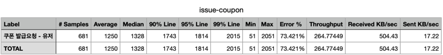
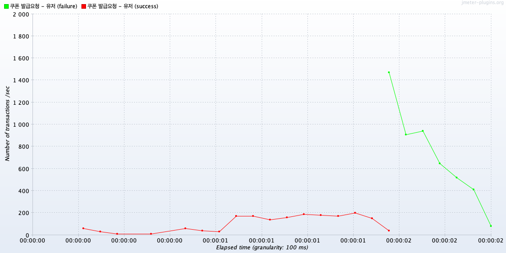
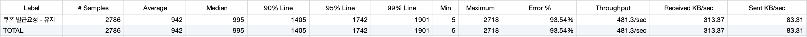
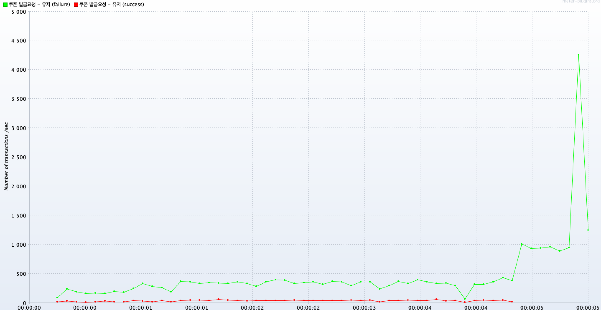

## 동시성 제어 - 쿠폰 발급
정해진 수량만 쿠폰 발급되도록 코드를 작성해보자 
 

1. mysql에서 제공하는 비관적 락을 사용한 동시성 제어   
퍼포먼스 테스트 (JMeter)  
임의의 유저 이메일을 CSV요청 정보에 담고 특정 쿠폰을 발급   
조건 : 500Thread, Ramp-up periods: 1, 쿠폰 수량: 180개

- Aggregate Report
 

- TPS 수치  

--- 아쉬운 점 ---  
데이터베이스가 Innodb엔진이라 수량 수정하는 부분에 대해서 row락이 걸리지만 단일 수정하는 사항이 단일 row이기때문에 사실상 테이블락과 다를게 없다고 생각한다.  
쿠폰 잔여 수량 측정하는 코드를 수정해야할 것 같다.

2. JPA에서 제공하는 낙관적 락을 사용한 동시성 제어   
   퍼포먼스 테스트 (JMeter)  
   임의의 유저 이메일을 CSV요청 정보에 담고 특정 쿠폰을 발급   
   조건 : 500Thread, Ramp-up periods: 1, 쿠폰 수량: 180개

- Aggregate Report
  

- TPS 수치  
  

--- 아쉬운 점 ---  
수량제어는 성공했지만 스레드 자체가 많다보니 비관적 락을 건 테스트보다 요청 샘플자체가 더 많긴하지만
낙관적 락의 버전 충돌에 의해 롤백되어서 TPS수치가 비관적 락을 건 데이터보다 오히려 좋지않았다.
낙관적 락을 걸어야한다면 충돌이 정말 최소한으로 발생하는 로직에 사용해주는게 맞다고 생각든다.
